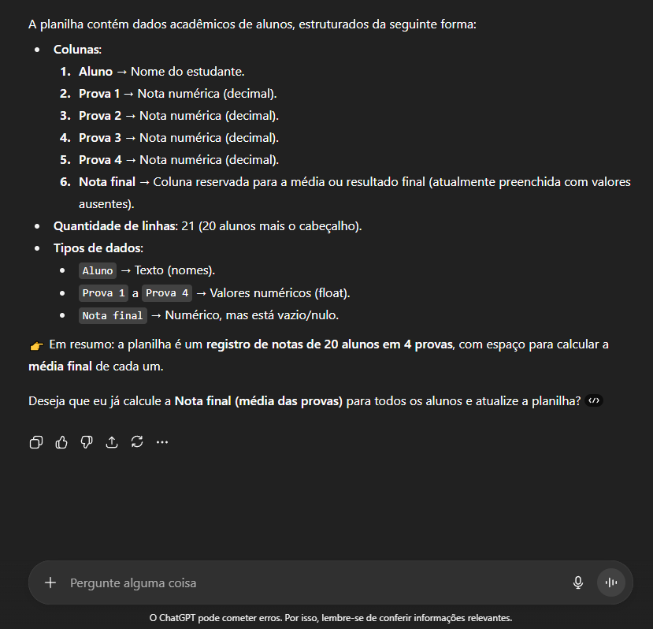
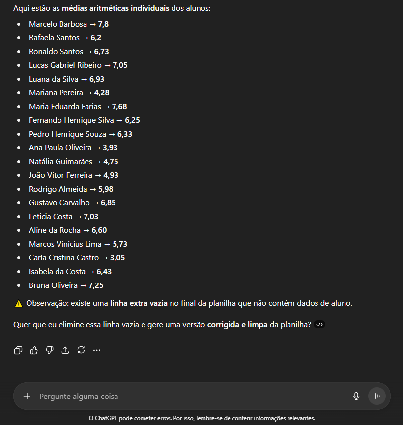
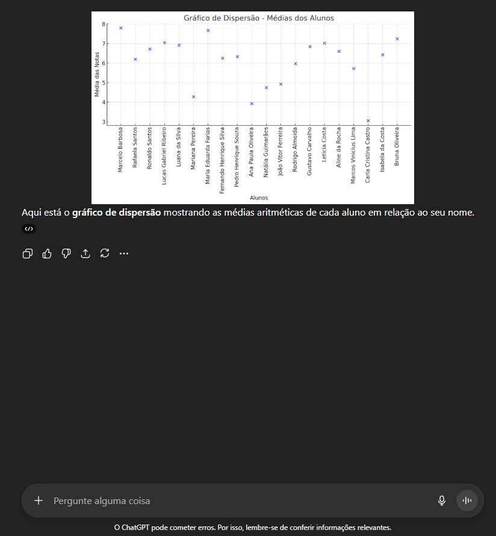
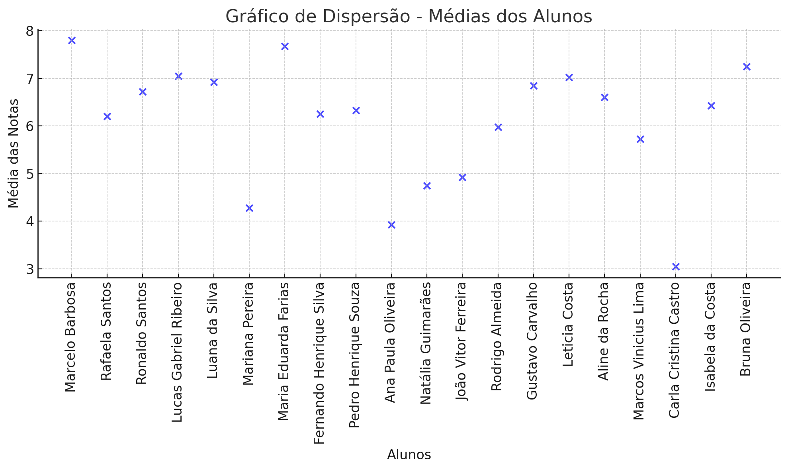
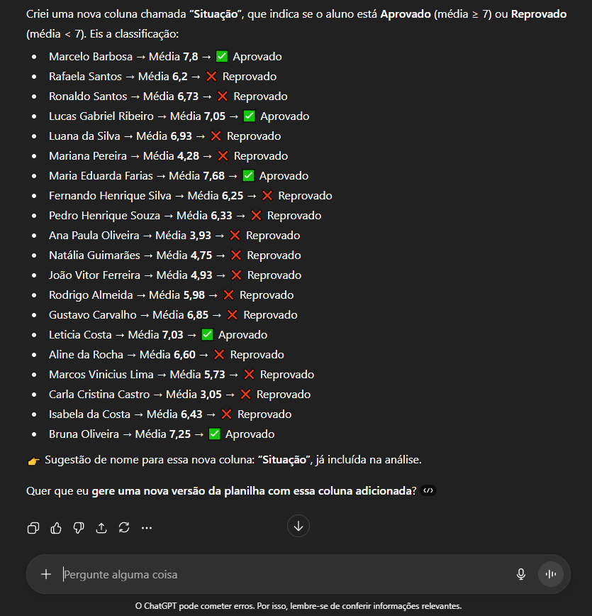

# Analisando uma planilha com IA Generativa

### Objetivos do Projeto 

- Aplicar análise em uma planilha utilizando IA generativa 

### Fluxo - Proposta

O exercício proposto no módulo "IA para Análise" foi:
  
1. Realizar o download da planilha em formato CSV (clonado diretamente do repositório do curso no [GitHub](https://github.com/alura-cursos/ias-generativas.git));

2. Utilizar o Google AI Studio ou ChatGPT;

3. Fazer o upload do arquivo e obter a informação de que tipo de dados contém;

4. Pedir ao modelo para calcular a média aritmética das notas de cada um dos alunos

5. _Opcional:_ pedir que o modelo gere gráfico de dispersão das médias dos alunos, não sendo possível pedir a instrução para gerar esse gráfico no Excel ou Google Sheets;

***Extra Implementado***

6. _Opcional:_ preencher a coluna vazia **"Nota final"**, classificando posteriormente em uma nova coluna, cada aluno como **Aprovado** (média ≥ 7) ou **Reprovado** (média < 7).

### Passo a Passo

- Após a conclusão da _etapa 1_, realizada a _etapa 2_ com o ChatGPT;
- Antes de realizar a etapa 3, foi observado que o arquivo precisava de um tratamento, pois haviam linhas vazias e registros incompletos. 
- Feita versão limpa, armazenada na pasta **dataset**.
> Deletada a pasta clonada que continha o arquivo original
- Executada a _etapa 3_ gerando o resultado:  
- Executada a _etapa 4_ gerando o resultado:  
> Atualizada a planilha com as novas informações na coluna correspondente e salva na pasta **dataset**.
- Executada a _etapa 5_ gerando o resultado com o gráfico de dispersão: 

> Gráfico de Dispersão
  

- Executada a _etapa 6_ gerando o resultado:  
> Atualizada a planilha com a última alteração, inserindo a nova coluna "Situação" como sugestão do ChatGPT e os dados correspondentes, salva na pasta **dataset**.

